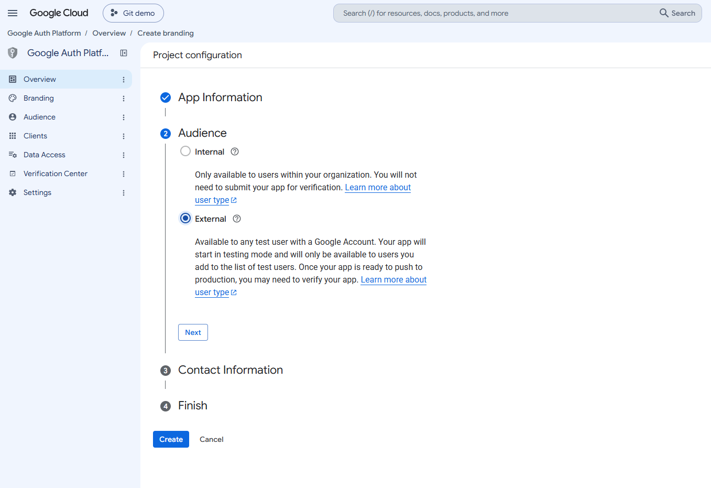

# Wayfarer Abuse Report Tools

Two companion Tampermonkey userscripts that pull Niantic Support's
"Reporting Abuse in Wayfarer" Helpshift ticket emails out of Gmail (or
`.eml` files), and extract a best-guess Wayspot name + coordinates from
each one into an exportable CSV. Their Tampermonkey/Plugin Manager
display names are **Wayfarer Map Mods - Abuse Email Importer** and
**Wayfarer Map Mods - Abuse Reports** (shortened from "Abuse Report
Extractor" as of extractor v1.45.0), so it's clear they're
WFMM-affiliated wherever they show up standalone — Tampermonkey's
dashboard, Plugin Manager's own list, devtools console — though the
underlying filenames (and their `@downloadURL`s below) are unchanged.

As of extractor v1.44.0, only **Abuse Reports** has its own entry in the
suite's native Settings side panel — the Email Importer's panel opens
from a small envelope icon inside that one instead, right next to the
Marker Style cog. They're still two genuinely separate scripts under the
hood (the importer needs `GM_xmlhttpRequest`, a sandbox-only API, for
Gmail OAuth — see "Why no `@require` for the suite" below for the
related, and more general, reason they can't just be merged into one
file), just with one shared entry point now instead of two. See "Where
to find things" for exactly where all of this sits.

Both hook into [Tntnnbltn's wayfarer-map-mods suite][base]'s own UI
service (`WFMM.ui`) for their panels — real, suite-native modals
(draggable/resizable if you've turned that on in Base's own settings,
same as every other WFMM modal), not a hand-rolled lookalike — rather
than having their own floating UI. Wayfarer itself moved to
`wayfarer.scopely.com`; both scripts and this README are updated for
that.

[base]: https://gitlab.com/Tntnnbltn/wayfarer-map-mods

## What's in here

| File | Role |
|---|---|
| `wayfarer-abuse-email-importer.user.js` | Gmail OAuth sync + `.eml` drop -> raw email store |
| `wayfarer-abuse-report-extractor.user.js` | Classifies stored emails, extracts name/coordinates, CSV export, map markers |
| `opr-email-lib.js` | Shared MIME parsing + classification library (pulled in via `@require`, not installed separately) |
| `wst-storage.js` | Shared IndexedDB wrapper for the raw email store (also `@require`d, not installed separately) |

The importer's only job is getting raw emails into a shared IndexedDB
store, unclassified. The extractor is the one that actually decides
what's an abuse-report ticket and pulls a location out of it. Splitting
them this way means you can re-run extraction as the parsing logic
improves without re-importing anything.

## Where to find things

The diagrams below are illustrative mockups, not literal screenshots —
they exist to show *where* each control lives, not to exactly match
Wayfarer's current visual styling.

**Settings side panel.** Open Base's side panel and there's exactly one
entry for both scripts now: **Abuse Reports**.


**Inside the Abuse Reports panel.** Three small icons sit next to the
summary line, top-right: a list icon (opens the **Marked Wayspots** list
— and the Favorite Users list under it — see "Marked Wayspots" below),
an envelope (opens the Email Importer's own panel) and a cog (opens
Marker Style settings, see below).


**Showing crosses on the map.** This plugin has no "Show on Map" button
of its own anymore (see "Plotting on the map" below for why) — it's the
**Abuse Report Crosses** entry in Base's native Layers menu instead,
same place every other map layer is toggled.


**On the review page.** A separate small on/off bar sits directly below
whichever map the review page itself is showing — not the Layers menu,
not the Settings panel. See "On the review page" below for why it's kept
apart.


## Requirements

- A userscript manager (Tampermonkey or compatible).
- **[Tntnnbltn's wayfarer-map-mods suite][base] (v4.0.0+) installed
  separately, on its own.** The extractor adds a link into its side panel
  settings section (`Abuse Reports`) — without it running, there's
  nowhere for that link, or the small envelope icon inside its panel
  that opens the importer, to appear. Don't `@require` it into anything
  else; see the "Why no `@require` for the suite" note below. Earlier
  versions of both scripts targeted the old separate
  `wayfarer-map-mods-base.user.js` — if you're still on that, update it
  to the consolidated v4.0.0+ suite first.
- A Google Cloud OAuth Client ID, **only** if you want Gmail sync. The
  `.eml` drop path works with no setup at all.

## Install

1. Install the wayfarer-map-mods suite first, if you haven't already.
2. Install the importer:
   `https://raw.githubusercontent.com/Frankmans/AbuseFormImport/refs/heads/main/wayfarer-abuse-email-importer.user.js`
3. Install the extractor:
   `https://raw.githubusercontent.com/Frankmans/AbuseFormImport/refs/heads/main/wayfarer-abuse-report-extractor.user.js`

`opr-email-lib.js` and `wst-storage.js` come along automatically via
`@require` — there's nothing to separately install for those two.

## Setting up Gmail sync (optional)

Only needed if you want automatic sync instead of (or alongside) dropping
`.eml` files by hand:

1. Go to the [Google Cloud Console](https://console.cloud.google.com/),
   create or pick a project (name does not matter).


   
3. **APIs & Services (shows in the menu on the top left) -> Library**: <ins>enable</ins> the **Gmail API**.


4. **APIs & Services -> OAuth consent screen**: set it up as External. If
   it's left in "Testing" mode (the default, and fine for personal use),
   add your own Google account under **Test users** or sign-in will be
   refused. Scope needed: `gmail.readonly`.





   
6. **APIs & Services -> Credentials -> Create Credentials -> OAuth client
   ID**. Application type: **Web application**.


   
8. Under **Authorized JavaScript origins**, add
   `https://wayfarer.scopely.com`. No redirect URI is needed — this
   uses Google Identity Services' popup token flow, not a redirect flow.
   If you set this up before Wayfarer moved off `wayfarer.nianticlabs.com`,
   add the new origin to the existing OAuth client rather than making a
   new one — Google validates against the page's actual origin at request
   time, so the old entry alone will now fail silently.


   
10. Copy the resulting Client ID (ends in `.apps.googleusercontent.com`)
   into the **Connect Gmail** field in the importer's panel (click on Abuse Reports in the panel on the right, and then on the envelop icon). It's saved
   in `localStorage` so you only paste it once; it's not a secret.


The access token itself is never persisted — it's requested fresh each
time the page loads and kept in memory only, for the session.

## Using it

1. On `https://wayfarer.scopely.com/new/mapview`, open the suite's side
   panel and click **Abuse Reports**.
2. Inside that panel, click the small envelope icon next to the summary
   line to open the Email Importer's own panel. Either **Sync new
   emails** (after connecting Gmail) or drop `.eml` files into the
   dropzone. Turn on auto-sync if you want it to check periodically
   without you opening the panel. Close it to land back on Abuse
   Reports.
3. Back in the Abuse Reports panel, click **Scan Imported Emails** — or
   skip this step entirely by ticking **Also scan for reports after
   importing** in the importer's panel (see "Scan after import" below),
   which does it for you after every import.
4. Review the table — one row per reported Wayspot, so a ticket that
   reports several (or has more added in a later reply) shows several
   rows sharing the same `Conversation ID`. Rows missing a name or
   coordinates are flagged so you can check the raw `Location Details` /
   `Report Details` columns by hand — then **Export CSV**, or turn on
   **Abuse Report Crosses** in the native Layers menu to see them
   plotted directly on the map instead (see "Plotting on the map"
   below).

Each row ends with a pencil (✎) that unlocks it for editing — see
"Editing a row" below. The table's **column widths are adjustable** — see "Resizing table
columns" below.

The **Conversation** and **Status** column headers are clickable to sort
— click again to flip ascending/descending, click the other header to
switch columns; Status sorts by pipeline stage (Received → Pending Review
→ a settled state), not alphabetically. Your chosen sort is remembered
across sessions. The small cog icon next to the same summary line opens
this panel's own **Marker Style** section — color, size, opacity, and a
clickable-markers toggle for the map markers it draws (see "Plotting on
the map" below).

Both scripts also show up as their own entries — with a name,
description, and enable/disable toggle — in the wayfarer-map-mods
suite's own **Plugin Manager** settings screen, alongside its bundled
features. Disabling one there tears it down cleanly (removes its panel
and side-panel link, stops its background watchers) rather than just
hiding it; re-enabling rebuilds everything fresh.

If a script works completely normally but doesn't show up under
**External plugins** in that screen, that's the exact symptom of a
Tampermonkey sandboxing issue fixed in importer v4.6.1 / extractor
v1.21.2 — any `@grant` other than `none` runs a script in a sandbox
where its own `window` isn't the same object as the page's, so
`window.WFMM` (which the suite assigns on the real page window) is
invisible to it; the script just quietly falls back to its older,
pre-Plugin-Manager self-starting behavior instead, which is why nothing
seems broken. If you're on an older version than that, update.

## Scan after import

The importer's panel has an **Also scan for reports after importing**
checkbox. With it on, any import that actually adds or updates at least
one email — a Gmail sync (manual, or a background auto-sync tick), a
dropped/picked `.eml` file, or a backup-JSON restore — immediately asks
the extractor to scan, so new tickets show up in the table and on the
map without opening the Abuse Reports panel and clicking **Scan
Imported Emails** yourself. It's the exact same scan that button runs
(starred rows and imported-CSV rows are carried across it the same way),
and it works with the Abuse Reports panel closed: any map crosses that
are showing (mapview/submit or review page) redraw with the new data.
The setting is saved. If the extractor isn't installed or hasn't loaded,
the importer logs a single "wasn't detected -- skipping" line rather
than failing.


Under the hood the extractor publishes
`window.WayfarerAbuseReportExtractor.scanImportedEmails()` for this —
the mirror image of `window.WayfarerAbuseEmailImporter`, which the
extractor already reads from — so the two scripts still only talk to
each other through the shared page window.

## What counts as an "abuse report" email

Gmail sync searches two sender addresses — `support@nianticlabs.com` and
`support-explore@scopely.com` (Niantic Support's Helpshift "Reporting
Abuse in Wayfarer" ticket threads; the second address, display name
"Scopely Explore Support," was added in v4.7.4 once tickets started
arriving from it — same Helpshift transcript format underneath, nothing
else needed to change for those to classify and extract correctly). Both
are kept rather than one replacing the other, since nothing confirms
Niantic's own address has actually stopped sending. It used to also pull
in general Wayfarer/Spatial/Ingress nomination-status notifications from
several other senders; that was narrowed in v4.4.0 to keep this tool
scoped to abuse reports specifically. Worth checking if tickets stop
arriving from either address — that'd be the sign a third one is now in
use.

Dropped `.eml` files are accepted from any sender — screening happens at
extraction time instead, via `opr-email-lib.js`'s `classify()`, which
only keeps emails it recognizes as `ABUSE_REPORT_*`.

## Multiple Wayspots per ticket

A single ticket can report more than one Wayspot — either all at once in
the original submission, or with more added in a later reply ("I see I
missed some: ...", or plain prose like "but Example Park North Gate
(lat,lng) of the same type has now been added by the same user"). The
extractor picks up all of these:

- The original form's **Provide details of the location(s)** field is
  split per line, so a report listing several Wayspots at once (each as
  its own `Name (lat, lng)`, `Name, lat,lng`, or `"Name" at lat,lng`
  line) becomes one entry per line, not just the first — including two
  entries that end up sharing one line with no separator at all between
  them, which can happen when a line break is lost during HTML-to-text
  conversion (see "Known limitations" below).
- Every other message in the thread is also scanned for locations — both
  structured list-style replies (handled the same way as the original
  field) **and** a coordinate mentioned in ordinary prose. A prose
  mention still adds the location, but its "name" is only kept if a
  short, clean label was actually found right before the coordinate;
  when it isn't (a whole sentence sitting in front of the coordinate
  instead of a clean label), the row is added with the name left blank
  rather than showing a run-on sentence as if it were a Wayspot name —
  the coordinate itself is what matters, and it's kept either way.

Each entry becomes its own CSV row, sharing that ticket's
`Conversation ID` / `Issue Type` / raw-text columns. Deliberately **not**
turned into a *new* location entry: a corrected coordinate mentioned in
the original submission's own free-prose fields (e.g. "(is actually here:
&lt;lat,lng&gt;)") — that's a correction to a Wayspot already named
elsewhere in the same message, not a new one, so treating every number
pair there as a distinct report would invent duplicate rows. A Street
View / Maps link found near a location isn't dropped, though — it's kept
as that entry's `Comment` (see below), whether it sits right after the
coordinate on the same line or a name and its coordinate happen to share
a line with a link. If a reply mixes a genuinely new Wayspot into the
same sentence as a correction, it may still need a manual check.

## Long-running tickets spanning several emails

An actively back-and-forth ticket generates a new email notification on
every reply, and each individual export only contains a recent window of
quoted history — not necessarily the complete conversation. If you've
imported more than one email for the same ticket, the extractor merges
all of them (deduping identical messages, re-sorting into one true
newest-first order by actual timestamp) into a single complete thread
*before* extracting — so a Wayspot mentioned only in an older email that's
since scrolled out of a newer one's quoted history still gets picked up,
and the original form fields still resolve even if the newest export's
own quoted history no longer reaches back that far. Import every email
you have for an active ticket, not just the latest one, for the most
complete picture — auto-sync already does this automatically.

## Replies sent from your own mail client

Clicking Helpshift's own reply link keeps the whole thread in Helpshift's
own transcript format. Replying using your mail client's normal reply
button instead (Gmail's, for example) works too, but the client wraps the
entire quoted history in its own `>` quoting, and can also re-derive the
quoted text from the original email's HTML rather than reusing its
plaintext part — a different, but still-recognized, transcript shape
under the hood. The extractor detects and unwraps this automatically,
splitting your own new reply text out as its own message and parsing the
quoted history normally underneath it, so a ticket doesn't stop
classifying or extracting correctly just because a reply came from your
own inbox instead of Helpshift's reply link.

## Starring rows & Last Response

Click a row's ★ cell to star it — matches Report History's own star
button (Report History calls it "Star", not "Favorite," so this does
too). The ★ column header is itself clickable to sort, same as
Conversation/Status: ascending shows starred rows first, same "starred
first" convention Report History uses for its own sort. A re-scan
rebuilds the extracted-records table from the source emails from
scratch, but starred rows stay starred across that — matched back up by
ticket + coordinates, not by an internal row id that isn't guaranteed to
survive a rebuild.

The **Last Response** column shows the newest message across every
email imported for that ticket, not just whichever single email
happened to get scanned — so it stays accurate for a ticket you've
imported several replies for (see "Long-running tickets" above). Also
sortable; rows with no parseable timestamp always sort last regardless
of direction. In the CSV export this is `Last Response (UTC)`, an
unambiguous ISO 8601 string rather than the locale-formatted date the
table itself shows.

## Importing locations from elsewhere (CSV)

**Import CSV** (next to Export CSV) is for locations that didn't come
from a scanned email at all — a known problem spot from another source,
something you want to track alongside everything else. It's not for
re-importing this tool's own export. Only a `Latitude`/`Longitude`
column pair is required (matched case-insensitively against a few
common header spellings — `Lat`/`Latitude`, `Lng`/`Long`/`Longitude` —
not one fixed name); `Name`, `Comment`, and `Conversation ID` columns are
all optional. The format hint above the button always shows a two-line
example, not just after a failed attempt:

```
Latitude,Longitude,Name,Comment,Conversation ID
1.234567,1.234567,Example Wayspot,Optional note,12345
```

Imported rows show up in the table and on the map like any other, with
their own **Imported** status badge (purple, distinct from the ticket
pipeline badges below) and their own **Imported color** map markers (see
"Marker Style") — and, since a re-scan otherwise rebuilds the
extracted-records table from scratch, they're explicitly carried
forward across one rather than getting silently wiped. They're also
called out by name in the **Clear Extracted Data** confirmation, since
—unlike scanned data — there's no source email to re-derive an imported
row from if either of those clears it.

## Editing a row

Every row in the table ends with a pencil (✎). Rows are locked by
default; click the pencil to unlock that one row, which turns its cells
into inputs: **Conversation**, **Wayspot Name** (plus a **Note** field
underneath), **Coordinates** (`lat, lng`, or blank for none), **Status**
(a dropdown) and **Last Response** (date/time picker). The pencil is
replaced by **✓** (save) and **✕** (discard); **Enter** saves and
**Esc** cancels. Only one row is editable at a time — opening another
discards the first one's unsaved changes. Coordinates that aren't a valid
`lat, lng` pair are rejected and the field is highlighted.

Saved edits update the table, the map crosses, nearby-ticket flags,
search and CSV export straight away. An edited row gets a small blue dot
next to its pencil, and — like starred and CSV-imported rows — is carried
across **Scan Imported Emails**: the freshly scanned copy of that row is
dropped in favour of your edited version (matched by its pre-edit
ticket + coordinates, so it works even if you changed the coordinates).
**Clear Extracted Data** still wipes everything, edited rows included.

## CSV columns

`Starred`, `Conversation ID`, `Ticket Status`, `Last Response (UTC)`,
`Wayspot Name (best guess)`, `Latitude`, `Longitude`, `Comment`, `Nearby
Tickets (<20m, other tickets)`, `Issue Type`, `Location Details (raw)`,
`Report Details (raw)`, `Source Email ID`, `Source Filename`.

`Comment` holds a Street View / Maps link found near that specific
location in a reply (real example: *"'t Zudn, &lt;lat,lng&gt; (is here:
&lt;corrected lat,lng&gt;, shows on street view: &lt;url&gt;)"*) — kept as
context for that entry rather than dropped or turned into a bogus extra
row. Shown as a hover-for-full-text 💬 in the panel's table since the
link itself is usually too long to display inline.

A hand-edited row exports its edited values (name, coordinates, status,
last response and so on), not the original scanned ones.

`Source Email ID` / `Source Filename` list every email that contributed
to that row (semicolon-joined) — for a long-running ticket merged from
several emails, that can be more than one.

`Nearby Tickets` lists any other ticket(s) with a location within 20m of
this row's — see "Flagging nearby duplicate reports" below.

`Issue Type`, `Location Details (raw)`, and `Report Details (raw)` are
only written once per ticket — on that ticket's first row — and left
blank on every other row it produced, since that text is genuinely
per-ticket, not per-location, and a 12-location ticket repeating the
same raw text 12 times just bloats the file. Use `Conversation ID` to
tell which blank rows belong to which ticket. `Comment`, by contrast, is
written on every row, since that one genuinely is per-location.

The two "(raw)" columns are there so you can sanity-check or hand-correct
a bad name/coordinate guess in a spreadsheet — there's no in-page editing
UI by design. Since a ticket can now span several rows, use
`Conversation ID` to group them back together if you need to.

## Ticket status

`Ticket Status` is Niantic Support's own reply, classified against three
confirmed canned closing messages:

| Status | Matches | Meaning |
|---|---|---|
| **Actioned** | *"We have reviewed the report and have taken action on the Wayspots in accordance with our policies."* | Reviewed and acted on — nothing further to do. |
| **Pending Review** | *"Thank you for your patience as your report is being looked into. We will follow up once we have reviewed the reported Wayspots."* | Still under review — revisit later. |
| **Denied** | *"We took another look at the Wayspot in question and decided that it does not meet our criteria for removal at this time."* | Reviewed, no action taken — also nothing further to do, distinct from Actioned. |

Two other values can show up: **Received** (just the initial auto-ack,
no human reply yet) and **Updated** (a reply that isn't one of the three
canned ones above — a custom human reply, or the reporter's own
follow-up being the newest message in the thread). Only the single
newest message in the thread is ever checked — not previous replies — so
if the reporter sends a follow-up (e.g. a "thanks!") *after* the real
decision, status reads Updated again even though it was actually decided
earlier; that's expected given how this is meant to work, not a bug.
Shown as a color-coded badge in the panel and included in search (e.g.
searching "pending" matches).

## Flagging nearby duplicate reports

Rows get a ⚠️ (and a subtle highlight) when their coordinates fall within
20m of a location extracted from a **different** ticket — the same spot
reported more than once, independently. Click the ⚠️ for a popover
listing which ticket(s) and how far away — each entry is clickable too,
jumping the map straight to that specific match so you can compare the
two directly. The same detail is in the CSV's `Nearby Tickets` column.

Locations within *one* ticket's own thread are never flagged against
each other — that's the expected multi-location shape this tool already
handles (see "Multiple Wayspots per ticket" above), not a duplicate worth
noticing. Flagging only fires across two distinct `Conversation ID`s.

## Data storage & privacy

Everything lives in IndexedDB, in your own browser, and never leaves it
except for the Gmail API calls you make yourself:

- `wst_email_store` — raw imported emails (importer).
- `wf-abuse-report-extract-db` — the extractor's own database, kept
  separate from both the importer's store and whatever the map-mods
  suite itself uses for its own data. Two object stores inside it:
  `extractedReports` (one row per reported Wayspot — name, coordinates,
  comment) and `ticketDetails` (one row per *ticket* — issue type and
  the raw report/location text, shared by every location row that ticket
  produced, rather than each row storing its own copy). You won't
  usually need to think about this split — every part of the panel
  (search, the table, CSV export) sees the two joined back together
  automatically — but it's why a 12-location ticket doesn't store its
  ~2.4KB of raw text twelve times over.

Your preferences and the two scratch lists don't live in IndexedDB at
all: Marker Style settings (including the Marked Wayspot and Favorite
user colors), the close-panel-on-jump checkbox, the table's column
widths, the copy-with-notes checkbox, the scan-after-import checkbox,
the Marked Wayspots list and the Favorite Users list are all kept in the
suite's own settings store (`WFMM.settings`), so they're included in
WFMM's **Settings > Backups** export/import.

Both panels have **Export backup JSON** / **Import backup JSON** /
**Clear** buttons for their respective stores. Clearing extracted data
doesn't touch the imported emails — re-scan any time to rebuild it.

## Known limitations

- Coordinate/name extraction is **best-effort**, confirmed and refined
  against a growing set of real tickets rather than derived from a spec —
  several real parsing bugs have been found and fixed this way (a blank
  author name on the reporter's own messages that an earlier header regex
  silently dropped, including the message with the actual report fields;
  a stray trailing character that could drop the last form field
  entirely; a URL landing in a location's name field instead of the
  actual name; two locations glued onto one line with no separator at all
  between them; a stray trailing `" at` left on a name under a third
  location-naming format, `"Name" at lat,lng`, that a ticket from the
  newer support-explore@scopely.com sender turned out to use). Full
  detail for each lives in `opr-email-lib.js`'s own inline comments, not
  repeated here — but the takeaway is the same: treat low-confidence rows
  as needing a manual check before you rely on them, especially anything
  unusual enough that it might be a format this hasn't been tested
  against yet.
- A location's *name* is only kept when a short, clean label was found —
  a coordinate mentioned in the middle of a longer sentence still adds
  the location, but with the name left blank rather than guessed at (see
  "Multiple Wayspots per ticket" above). A reply that mixes a genuinely
  new Wayspot into the same sentence as a correction to an existing one
  may still need a manual check.
- No inline editing of extracted rows — corrections happen in the
  exported CSV.

## Searching

The extractor panel has a search box above the table. It filters against
name, conversation ID, comment, issue type, both raw text fields, and the
source filename/email ID — not just what's shown in the columns, since a
query is more likely to hit the raw `Location Details`/`Report Details`
text than the best-guess name. A leading `#` is stripped before matching,
so `#12345` finds the same reports plain `12345` does — handy since Live
Wayspot annotation (see "Plotting on the map" above) shows ticket
references on the map itself in that `#12345` form. It only changes what's
*displayed* — **Export CSV**, the map crosses (Layers menu), and the
summary counts above the table all still reflect everything, not just the
currently-filtered rows.
Typing is debounced (200ms) rather than filtering on every keystroke.

## Large histories (thousands of rows)

The table only ever renders 200 rows at a time (**Prev**/**Next**
controls appear once you have more than that), regardless of how many
total rows exist or how many match a search — confirmed via benchmark
that rendering the full table as real DOM elements, not the underlying
computations, is what actually gets slow once a real history reaches
into the thousands. Nearby-duplicate detection and map clustering both
stayed fast (well under 100ms) even at 15,000+ rows in testing, so if
things still feel sluggish at that scale, it's worth checking whether
something's re-rendering the full table rather than paging through it.

Storage itself is also lighter than it used to be — issue type and the
raw report/location text are now stored once per *ticket*, not once per
*location* (see "Data storage & privacy" above), which measured as
roughly an 80% reduction in stored bytes at a realistic 15,000-row scale
with real-sized report text. Search, CSV export, and everything else
still see the exact same data on every row — this only changed how it's
stored, not what any part of the panel shows.

## Plotting on the map

Turn on **Abuse Report Crosses** in the native **Layers** menu (see
"Where to find things" above) to plot every extracted location directly
on the Wayfarer map — the same idea as Report Wayspots' own
reported-wayspot history markers, but for what this script extracted
from imported emails, and without needing Report Wayspots installed.
This used to be its own "Show on Map"/"Hide from Map" button inside the
extractor panel; that was removed once the same on/off state got
registered as a real Layers-menu entry instead, since keeping both would
just have been two controls doing the same thing. Nearby locations
cluster into a single numbered badge when zoomed out, splitting apart
into individual X markers as you zoom in close enough to tell them apart
— clustering is based on actual on-screen distance at the current zoom,
not a fixed real-world radius, so it adapts correctly whether you're
looking at the whole country or one neighborhood. Click an individual
marker for its name, coordinates, comment, and ticket ID (followed by
the date of that ticket's last interaction, same format as above);
click a cluster to zoom in on it. A cluster whose reports all sit at
the same (or near-identical) coordinates can never be split apart by
zooming, so once the map is already at the deepest zoom a cluster click
uses, clicking it opens a popup listing every ticket in it — ticket
number, Wayspot name and last-interaction date — instead. The layer's on/off state is remembered by the
suite itself and re-attaches automatically next time a map-having page
loads if you left it on — including right away on a fresh page load, no
need to open the panel or touch the toggle first; markers stay in sync
automatically after every scan or clear while it's on.

Works on **both** the general mapview and the zoomed-in submit/edit view
you land on when nominating or reviewing a specific Wayspot — those are
two separate `google.maps.Map` objects under the hood, and switching
between them is picked up automatically, no manual re-toggle needed. Map
lookup goes through the suite's own shared `WFMM.map` service (the same
one Report History relies on, with its own dedicated, maintained support
for both pages) rather than anything this script tries to work out for
itself.

Every table row with coordinates is clickable too, independent of whether
the map markers themselves are toggled on — click a row to jump the map
straight to that location (centering and zooming in) and show the same
info popup there. Since the panel is a full-screen backdrop, clicking a
row also closes it, so the map you just navigated to is actually
visible — uncheck **Close this panel when a row jumps the map to its
location** (below the search box) if you'd rather click through several
rows in a row without the panel closing out from under you each time; a
row click still centers/zooms and opens the popup either way, the panel
just stays open too.

### Live Wayspot annotation

Independent of the crosses layer being on at all: click any Wayspot on
the map (this plugin's own or an ordinary one) and, if it's within 20m
of one of this plugin's extracted locations, its native details card in
the side panel gets a `#<ticket>` line added just above the status
badge — multiple matching tickets show comma-separated. The line ends
with the **date of the last interaction** on the ticket(s), taken from
the same newest-message timestamp as the table's Last Response column
(short date in the line, full date and time on hover); when several
tickets match, only the single most recent date is shown, not one per
ticket. A ticket with no parseable date shows no date.


(The note field, the **+ add to abuse report draft** button and the
clickable submitter name in that mockup are covered under "Marked
Wayspots" and "Favorite users" below.) This uses the
same public side-panel service Base's own code builds that card with, so
it adds to the real card rather than replacing it or drawing a
lookalike; nothing shows if there's no match, same as before this
existed.

### On the review page

Crosses also plot on `https://wayfarer.scopely.com/new/review` — the
duplicate-check map (and the edit-location/edit-info maps that page can
show too), so you can see nearby prior abuse reports right while
reviewing a nomination. This is deliberately **not** the same on/off
switch as the Layers-menu checkbox above, and it's **not** reachable from
the Settings side panel either — see "Where to find things" for the
small toggle bar that sits directly below the review page's own map
instead. Two reasons for the separation: Base's own map-tracking
(`WFMM.map`) never covers the review route in the first place, so this
needed its own map lookup regardless; and keeping the Settings side
panel and this plugin's own tool panel exclusive to the mapview/submit
pages was a deliberate requirement, not an oversight, so review support
gets its own small toggle rather than adding a second checkbox to a menu
that otherwise doesn't apply there. The toggle defaults on, and — same
as the mapview/submit crosses — its color follows Wayfarer's own dark
mode correctly, not just your OS/browser's light-dark setting. Review
markers are always click-through, regardless of the "Clickable markers"
setting under Marker Style — see that section below for why.

### Marker Style

Opened via the small cog icon next to the Abuse Reports panel's summary
line (see "Where to find things" above), this section covers: color,
size, fill opacity, ring color/width/opacity for the cluster badges, an
**Imported color** for CSV-imported locations (see "Imported markers"
just below), and a **Marked Wayspot color** and a **Favorite user color**
(see "Marked Wayspots" and "Favorite users" below), and a **Clickable markers
(mapview/submit only)** toggle (turn it off to let
clicks pass through to whatever's underneath — the map itself, or a
Wayspot marker at the same spot — instead of opening this plugin's own
popup). As the label says, that toggle only ever governs the
mapview/submit crosses — review-page markers are always click-through,
regardless of this setting, since a click there is far more likely meant
for the review UI underneath (selecting a duplicate candidate, etc.)
than for this plugin's own popup or cluster-zoom. Color/size/opacity
changes still apply live to both surfaces if markers are already
showing. The individual-report X shape itself stays fixed by design —
it's meant to read as "a problem here," distinct from an ordinary POI
dot — only its color and size are adjustable; the cluster badge, already
a filled circle, gets the full set of controls.

**Imported markers.** Locations brought in with **Import CSV** (the
purple *Imported* rows) have their own **Imported color** entry in Marker
Style, next to **Color** (which is for reports scanned from emails). It
starts out identical to **Color** and *follows* it — change **Color** and
the imported markers change with it — until you pick a color of your own
for **Imported color**, at which point the two are independent. **Same as
email color** (or **Reset to default**) puts it back to following. Only
the color is separate: imported markers use the exact same **Cross size**,
**Cluster size**, fill opacity and ring settings as the email markers, so
the two always scale together. A cluster badge takes the imported color
only when *every* location in it is imported; a cluster mixing imported
and email-sourced locations keeps the email color. It applies on both the
mapview/submit crosses and the review-page markers.

These settings are also registered with `WFMM.markerAppearance` (the
suite's own marker-styling engine), so this is a real, discoverable style
bucket in that system, not just an internal constant only this script
knows about. One honest caveat: that does **not** mean this shows up as a
new row in the suite's own built-in marker-color settings screen (the one
listing Wayspots/Pokéstops/Gyms/Power Spots) — that particular screen's
list of kinds is hardcoded in the suite itself, with no way for another
script to add an entry to it. The underlying styling engine it's built on
is genuinely shared, general-purpose infrastructure, though, which is why
using it here was possible at all — it just surfaces through this
plugin's own panel instead of that one fixed screen.

The suite itself has no marker-*plotting* API (styling and lookup are
separate concerns from actually drawing something) — this plots results
as native `google.maps.Marker` objects (custom SVG icons, built from the
Marker Style settings above) rather than anything from the suite, so it
doesn't read as the same layer as its own reported-wayspot history
markers. `window.WayfarerAbuseEmailImporter.publishPoiToMap()` is
unrelated to this — it used to hand a POI to a `#wfmapmods-poi-bridge`
element for the suite's own side-panel selection (never a map marker,
even before this), but that bridge was removed entirely in the suite's
v4.0.0; the function is now a documented no-op kept only for API
compatibility. Real map-plotting has only ever been this script's own
Layers-menu crosses (see "Plotting on the map" above). That same
`window.WayfarerAbuseEmailImporter` object is also what the extractor's
own envelope icon calls into as of the importer's v4.10.0 —
`openPanel()`/`closePanel()`/`togglePanel()`/`isPanelOpen()`, alongside
`publishPoiToMap()` and `getAbuseReportRecords()`.

Markers reposition themselves via the Maps SDK on pan with no app code
involved, but a full re-render (recomputing clusters) does run on every
zoom step — that's necessary now since clustering itself is zoom-
dependent, and it's cheap (grid-bucketed, not pairwise) so it stays fast.
Data-driven rebuilds (a scan, a clear, first turning the toggle on) work
the same as before.

Rendering hundreds of individual markers used to be the real remaining
slowdown once a dataset grew large, even after the fixes above — each
one has genuine linear overhead regardless of how cheap any single
marker is. Nearby locations now cluster into a single numbered badge
based on actual on-screen pixel distance at the current zoom (not a
fixed real-world radius), splitting apart as you zoom in — same
grid-bucketing idea as the nearby-duplicate detection below, just in
screen-pixel space. A synthetic 450-location test (30 tickets × 15
locations, matching real multi-location extraction scale) rendered just
21 markers zoomed out vs. 447 zoomed in close enough to distinguish them.

Separately, the ⚠️ nearby-duplicate detection used to recompute on every
panel *open* too (not just when data changed), and did it as a full
pairwise scan — with a few thousand accumulated rows that was slow enough
to visibly hang the panel while opening. It's now grid-bucketed (only
compares records in the same ~111m neighborhood, not every pair) and
skipped entirely when nothing's changed since last time.

## Resizing table columns

Drag the border between two column headers in the abuse-report table to
resize them; the cursor turns into a resize arrow over the border. A drag
only trades width between the two columns it sits between, so the table
always stays exactly full-width — no horizontal scrollbar — and no column
can be squeezed below a small minimum. There's no handle after the last
column (nothing to its right to trade with). Widths are remembered per
column and carry across sessions; they're stored with the suite's
settings, so they also travel with **Settings > Backups** (see "Data
storage & privacy").


## Marked Wayspots

A separate scratch list for Wayspots you're about to report yourself —
distinct from the ticket table above, which is about reports already
filed. Nothing on it reads from or writes to the extracted-ticket data.

**Adding.** Click a Wayspot on the map and, in its details card in the
side panel, there's a small note field and a **+ add to abuse report
draft** button. Type a note first if you like (up to 300 characters),
then click the button — it flashes **✓ Added**. Adding a Wayspot that's
already on the list (matched by coordinates, not name) doesn't create a
second entry: it overwrites that entry's note with whatever's in the
field this time — including clearing it if the field is empty — and
flashes **✓ Updated** instead. A Wayspot's name is only ever filled in
or upgraded this way, never blanked; an "Untitled location" is stored
with no name and shown as "(unnamed)". The same note field and button
also appear on the review page — see "Abuse helper on the review page".

**The list.** Open it with the list icon in the Abuse Reports panel
header (titled **Abuse Reports - Marked Wayspots**):


- A **Report abuse via Wayfarer Help Center** link to Niantic's
  "Reporting Abuse in Wayfarer" article, where the copied text is meant
  to be pasted.
- **Copy All** puts one line per entry on the clipboard, formatted
  `Name, lat, lng (note)` — coordinates to six decimals, the
  parenthesised note only when there is one.
- **Include notes when copying** (checked by default) turns that note
  off, giving plain `Name, lat, lng` lines. Saved, and it also governs
  the copy icon on the review page.
- **Clear All** empties the list (asks for confirmation first).
- Each row shows the name and coordinates. **Click the row** to jump the
  map there (centering, zooming in, and opening an info popup with the
  name, coordinates and note). Click a row's **note** to edit it in
  place — click anywhere outside the box to save — and click **×** to
  remove the entry.

**On the map.**


Every entry also gets a cross-shaped marker on the
mapview/submit map, in its own color (default blue, changed with
**Marked Wayspot color** in Marker Style) and sized by the same **Cross
size** slider as the abuse-report crosses; click one for its name,
coordinates and note. They aren't clustered. They follow the **Abuse
Report Crosses** checkbox in the Layers menu — untick it and they hide
along with the abuse-report crosses, tick it again and they come back.

The list is saved with the suite's settings (so it's included in
**Settings > Backups**), not in IndexedDB.

## Favorite users

When Wayfarer shows a **Submitted by <username>** line in the side panel
(for instance while reviewing a nomination), the username itself is
clickable: click it to mark that user as a favorite, click again to
remove them. A favorited username turns bold and takes on a color you
choose with **Favorite user color** in Marker Style (default amber; it
updates immediately, and **Reset to default** restores it). Names are
matched ignoring case and surrounding spaces, so the same person is the
same favorite however it's capitalised.

Favorites are listed in a **Favorite Users** section in the same window
as the Marked Wayspots list, each in the favorite color with an **×** to
remove it, plus a **Clear All** (asks for confirmation first). Only the
username is clickable — the "Submitted by" prefix stays plain text — and
the feature only appears where the side panel actually shows that line.
Like the Marked Wayspots list, it's stored with the suite's settings.

Each favorite also has its own **note** underneath the name (up to 1000
characters): click **Click to add a note…** to open a small text box,
type, and click anywhere outside it to save. The note is shown in the
list only — it isn't part of anything you copy.

**Copying usernames.** Every row has a checkbox. **Copy All** copies
every username, one per line; **Copy Selected** (which shows a count,
e.g. *Copy Selected (3)*, and stays disabled until something is ticked)
copies just the ticked ones. Both copy usernames only — never notes —
and the button briefly reads **Copied!** (or **Copy failed**). Ticked
boxes are a this-window-session convenience and aren't saved; they reset
when the window is reopened or when you **Clear All**.

## Abuse helper on the review page

This folds in what the standalone **Wayfarer Abuse Text Formatter**
script did, so you no longer need it — uninstall it once this is
running, or you'll see both its text line and this. On
`https://wayfarer.scopely.com/new/review`, every review candidate (new
Wayspot, photo or edit) gets a small row containing:


- a **copy icon** — instead of showing the text, it copies
  `Name, lat, lng` in exactly the same format as the Marked Wayspots
  list's Copy All (with the note you've typed in the row's own field
  appended when **Include notes when copying** is on). The icon turns
  into a check mark briefly to confirm;
- the same **note field** and **+ add to abuse report draft** button as
  the side panel, adding the candidate to the Marked Wayspots list
  (overwriting the note if it's already there);
- an **Abuse form** link to the same Help Center article as the list's,
  opening in a new tab so the review in progress isn't lost.

The candidate is read from the review page's own data request
(`GET /api/v1/vault/review`) — the same way the old script did it — and
the row is placed where that script put its text: before the first
`.mt-2` element on a new/photo card, and as the second child of
`.review-edit-info` on an edit card. Captcha responses are ignored. The
row only appears while the plugin is enabled in the Plugin Manager.

## Why no `@require` for the suite

Earlier versions of both scripts `@require`d Tntnnbltn's Base script
directly. That turned out to be wrong: `@require` re-fetches and
re-executes the *entire* required file separately inside **each**
userscript that lists it, not a single shared instance. With two scripts
both requiring it, that meant two independent copies running on the same
page, each building its own `#wfmapmods-side-panel` — and since it had no
guard against a second, separately-required copy, whichever one you
could see wasn't necessarily the one a script had actually inserted its
link into.

Base's real companion script, Report Wayspots (now merged into the same
consolidated `wayfarer-map-mods.user.js` suite as of v4.0.0), never
`@require`d it either — it's installed once, standalone, and every other
script just assumes exactly one copy is already running and talks to it
purely through the DOM (`.wfmapmods-settings-links`, `#wfmapmods-side-panel`).
Both scripts here do the same.

## Architecture at a glance

```
Gmail  ──┐
         ├─▶ wayfarer-abuse-email-importer.user.js ─▶ wst_email_store (IndexedDB)
.eml  ───┘         (raw, unclassified {headers, body})
                             │
                             ▼
              wayfarer-abuse-report-extractor.user.js
        (classify via opr-email-lib.js, extract name + coords)
                             │
                             ▼
              wf-abuse-report-extract-db (IndexedDB)
                             │
                             ▼
                          CSV export
```

The two scripts also call each other through the shared page window:
the extractor reads `window.WayfarerAbuseEmailImporter`, and the
importer calls `window.WayfarerAbuseReportExtractor.scanImportedEmails()`
for scan-after-import (see "Scan after import").

`opr-email-lib.js` is a vanilla-JS port of
[bilde2910/OPR-Tools](https://github.com/bilde2910/OPR-Tools)'s
`src/email` module (parsing, classification, Helpshift thread
extraction) — shared by both scripts, with no build step or bundler
needed since it's plain `@require`-able JS.

## Versions covered by this README

- `wayfarer-abuse-email-importer.user.js` — v4.11.0
- `wayfarer-abuse-report-extractor.user.js` — v1.62.0
- Verified against `wayfarer-map-mods.user.js` v4.3.0 (the consolidated
  suite both scripts depend on — see Requirements above).

Full version-by-version detail lives in the changelog comment block at
the top of each `.user.js` file. This README is caught up as of
extractor v1.62.0 and importer v4.11.0 (the v1.58.0–v1.60.5 stretch had
no changelog block in the file to draw from, so only behavior that could
be confirmed in the code is documented — see "Starring rows", "Favorite
users" and the new "Editing a row" section — rather than a
version-by-version list for those releases), including everything added
between v1.26.1 (this
file's previous checkpoint) and now: the star/favorite column and Last
Response column (v1.31.0/v1.28.0), Import CSV (v1.34.0), the auto-close
checkbox (v1.27.0), live Wayspot ticket annotation (v1.30.0), the
"Show on Map" button's removal in favor of the native Layers-menu
checkbox (v1.33.0), the display-name shortening (v1.45.0), the
first-page-load crosses fix (v1.46.0), review-page support (v1.43.0+),
and the Email Importer's envelope-icon integration (v1.44.0, importer
v4.10.0+). Since then: the review toggle bar's position-tracking fix
(v1.47.0), cluster clicks jumping to a fixed zoom 20 (v1.48.0),
review-page markers being permanently click-through (v1.49.0), and
search matching a leading "#" the same as no "#" (v1.49.1). Then, in
order: the review toggle bar returning to the page's own layout (v1.50.0)
and the same-coordinates cluster popup (v1.50.4); the Marked Wayspots
list with its side-panel button, note field, help-center link, map
crosses and duplicate-overwrite behavior (v1.51.0–v1.53.5, v1.53.4 tying
the crosses to the Layers checkbox); last-interaction dates after ticket
numbers (v1.53.9); resizable table columns (v1.54.0); Favorite users and
their color setting (v1.55.0–v1.55.2); the copy-with-or-without-notes
checkbox (v1.56.0); the review-page abuse helper replacing the Abuse
Text Formatter script, with its "Abuse form" link (v1.57.0–v1.57.1);
and, on the importer side, scan-after-import (importer v4.11.0, extractor
v1.53.7). Newest: the pencil column for editing a row, with edits kept
across re-scans (v1.61.0), a separate Imported color for CSV-imported
markers sharing the email markers' sizing (v1.62.0), and the Favorite Users notes and Copy
All / Copy Selected controls now documented. Smaller
internal/performance-only changes in between aren't each individually
called out here — see the changelog block itself for those.
