# Wayfarer Abuse Report Tools

Two companion Tampermonkey userscripts that pull Niantic Support's "Reporting Abuse in Wayfarer" ticket emails out of Gmail (or `.eml` files) and extract a best-guess Wayspot name and coordinates from each one. The results end up in a searchable table that you can plot on the Wayfarer map or export as CSV.

| Script | What it does |
|---|---|
| **Wayfarer Map Mods - Abuse Email Importer** | Gets your ticket emails in, via Gmail sync or by dropping `.eml` files |
| **Wayfarer Map Mods - Abuse Reports** | Reads the imported emails, extracts name and coordinates, shows the table, draws map markers and exports CSV |

Both scripts are add-ons for [Tntnnbltn's wayfarer-map-mods suite][base] and use its native panels and settings. Re-running extraction never requires re-importing your emails.

[base]: https://gitlab.com/Tntnnbltn/wayfarer-map-mods

## Requirements

- A userscript manager (Tampermonkey or compatible).
- **[Tntnnbltn's wayfarer-map-mods suite][base] (v4.0.0 or newer), installed separately on its own.** The scripts add their entry to the suite's side panel, so without it they have nowhere to appear. If you are still using the old `wayfarer-map-mods-base.user.js`, update to the consolidated suite first.
- A Google Cloud OAuth Client ID, **only** if you want Gmail sync. Dropping `.eml` files works with no setup at all.

## Install

1. Install the [wayfarer-map-mods suite](https://gitlab.com/Tntnnbltn/wayfarer-map-mods) first, if you haven't already.
2. Install the [importer](https://raw.githubusercontent.com/Frankmans/AbuseFormImport/refs/heads/main/wayfarer-abuse-email-importer.user.js).
3. Install the [extractor](https://raw.githubusercontent.com/Frankmans/AbuseFormImport/refs/heads/main/wayfarer-abuse-report-extractor.user.js).

The two helper libraries (`opr-email-lib.js` and `wst-storage.js`) are downloaded automatically. There is nothing else to install.

## Setting up Gmail sync (optional)

Only needed if you want automatic sync instead of (or alongside) dropping `.eml` files by hand.

1. Go to the [Google Cloud Console](https://console.cloud.google.com/) and create or pick a project (the name does not matter).

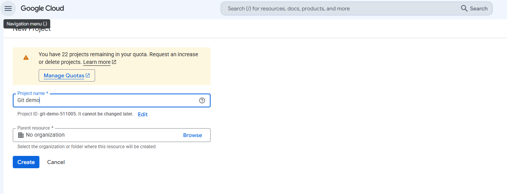

2. **APIs & Services (in the menu at the top left) -> Library**: <ins>enable</ins> the **Gmail API**.

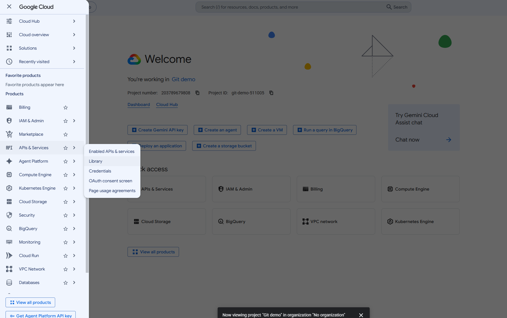
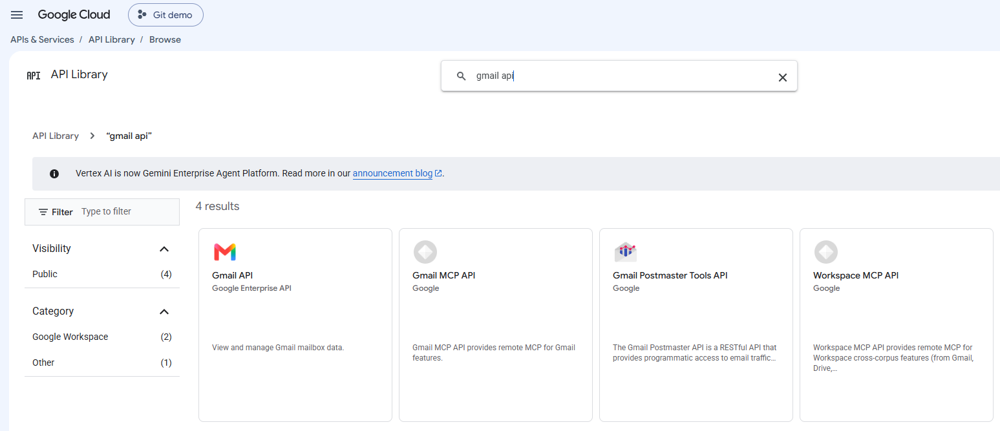
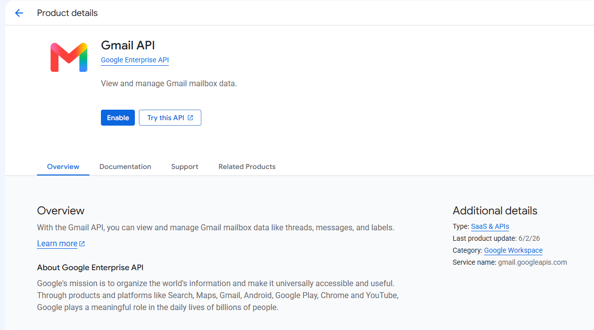

3. **APIs & Services -> OAuth consent screen**: set it up as External.

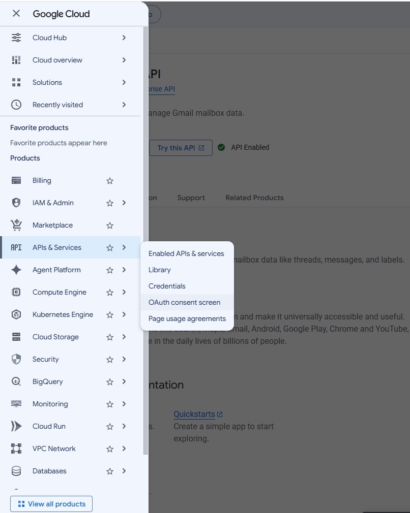
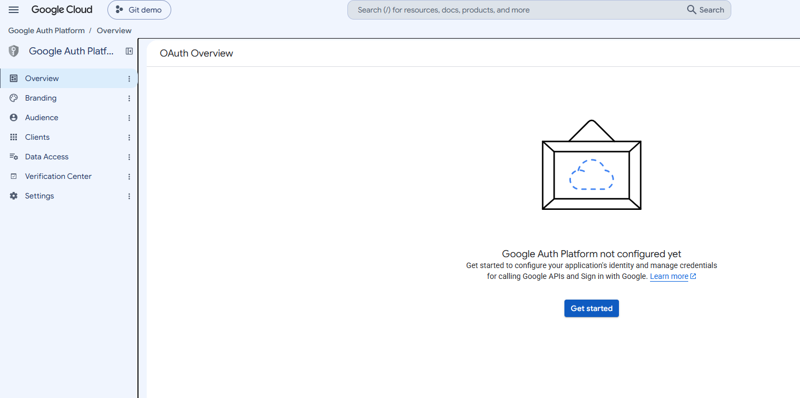
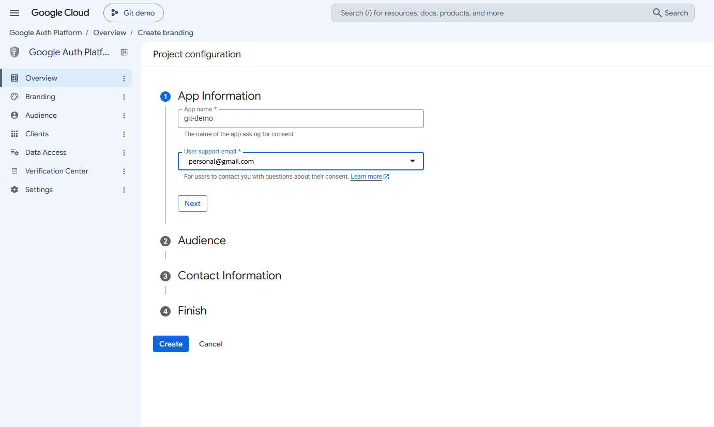
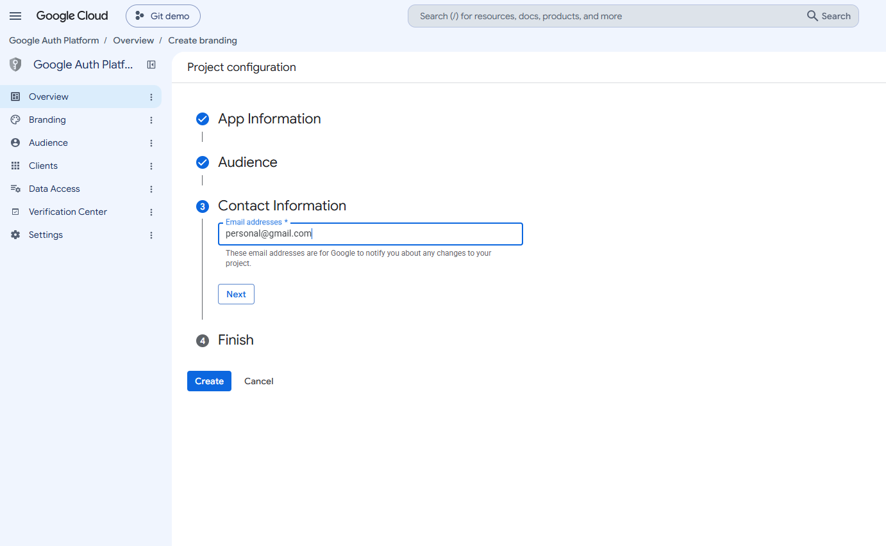
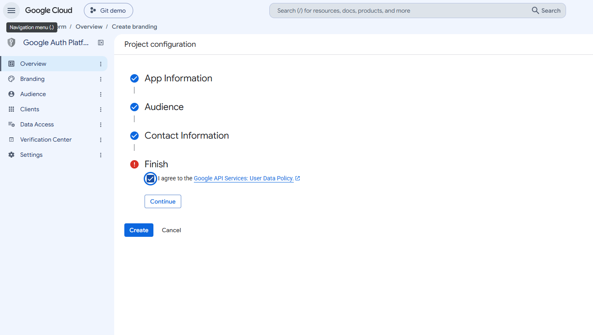

4. While in "Testing" mode (the default, and fine for personal use), add <ins>your own Google account</ins> under **Test users**, or sign-in will be refused. The scope needed is `gmail.readonly`.

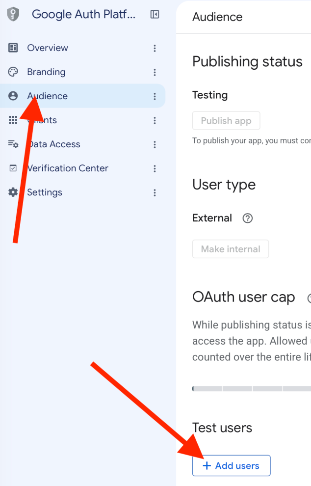

5. **APIs & Services -> Credentials -> Create Credentials -> OAuth client ID**. Application type: **Web application**.

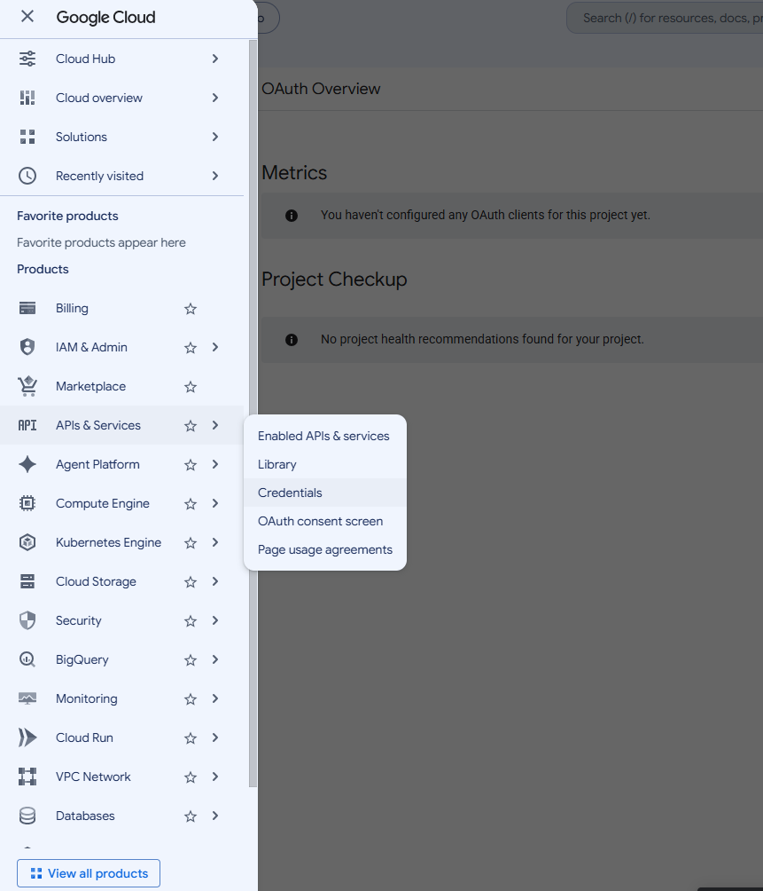
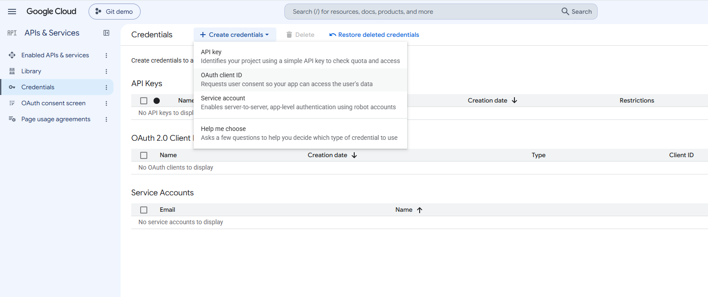

6. Under **Authorized JavaScript origins**, add `https://wayfarer.scopely.com`. No redirect URI is needed. If you set this up back when Wayfarer lived on `wayfarer.nianticlabs.com`, add the new origin to your existing OAuth client rather than creating a new one. The old entry alone will fail silently.

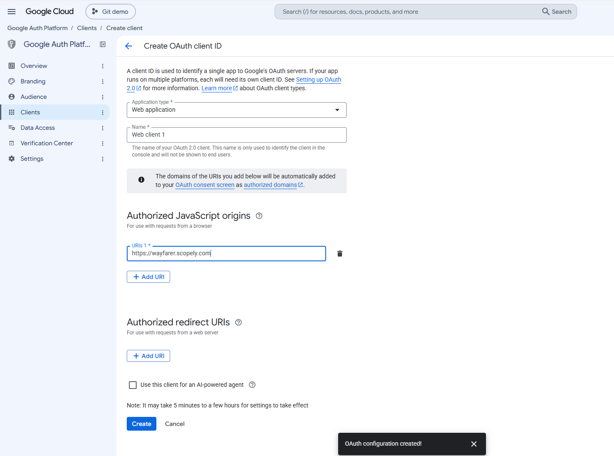

7. Copy the resulting Client ID (it ends in `.apps.googleusercontent.com`) into the **Connect Gmail** field in the importer's panel (click **Abuse Reports** in the side panel, then the envelope icon). It is saved in your browser, so you only paste it once. It is not a secret.

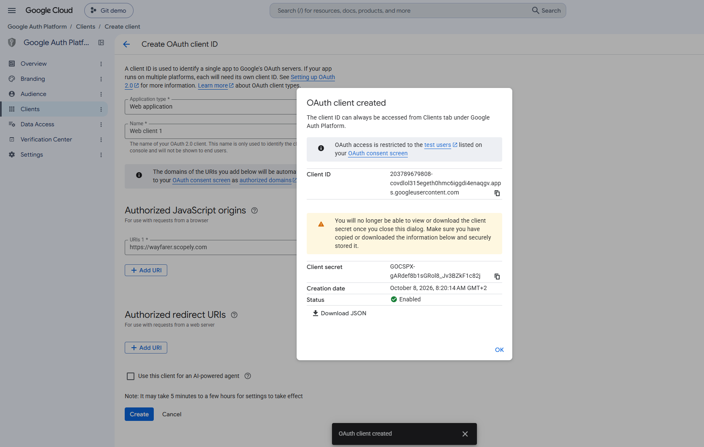
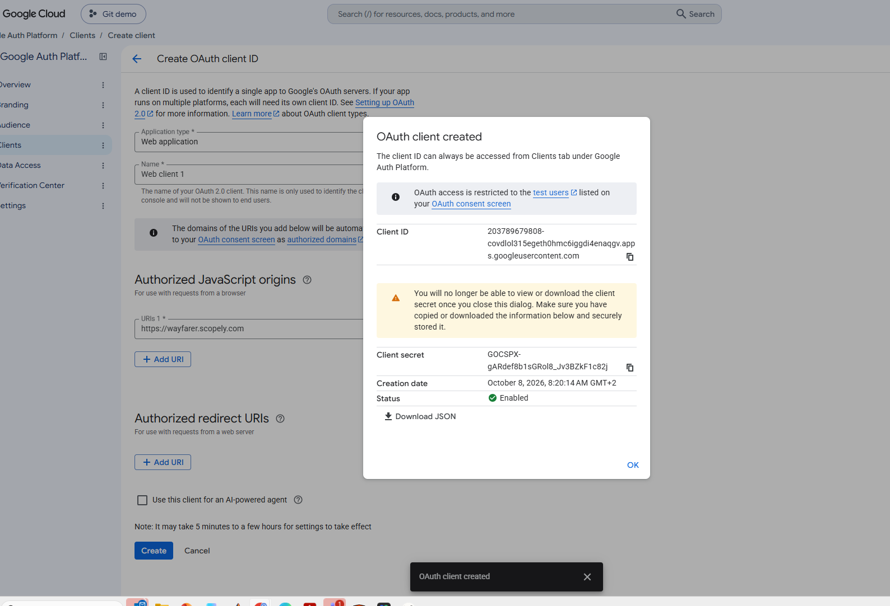

Your access token is never saved. It is requested fresh each time the page loads and kept in memory for that session only.

## Where to find things

The diagrams below are illustrative mockups rather than literal screenshots. They show *where* each control lives, not Wayfarer's exact styling.

**Settings side panel.** Open the suite's side panel and you'll find one entry for both scripts: **Abuse Reports**.

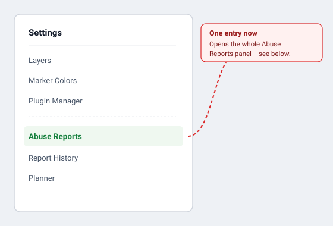

**Inside the Abuse Reports panel.** Three small icons sit next to the summary line, top right: a list icon (opens the **Marked Wayspots** list and the Favorite Users list), an envelope (opens the Email Importer) and a cog (opens Marker Style settings).

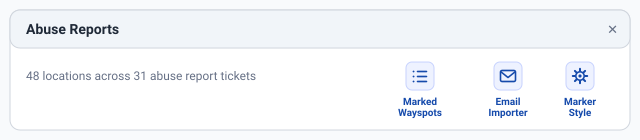

**Showing crosses on the map.** Tick **Abuse Report Crosses** in the native **Layers** menu, the same place every other map layer is toggled.

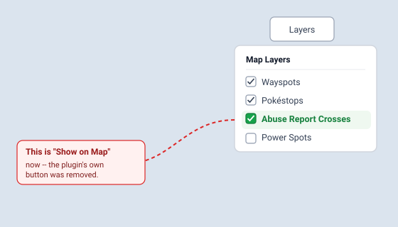

**On the review page.** A small on/off bar sits directly below the map on the review page. It is separate from the Layers menu and the Settings panel.

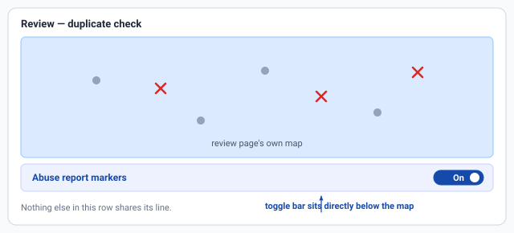

## Using it

1. On `https://wayfarer.scopely.com/new/mapview`, open the suite's side panel and click **Abuse Reports**.
2. Click the envelope icon next to the summary line to open the Email Importer. Either **Sync new emails** (after connecting Gmail) or drop `.eml` files into the dropzone. Turn on auto-sync if you'd like it to check periodically without you opening the panel. Close the importer to return to Abuse Reports.
3. Back in Abuse Reports, click **Scan Imported Emails**. Or tick **Also scan for reports after importing** in the importer's panel to have this happen automatically after every import (see [Scan after import](#scan-after-import)).
4. Review the table. There is one row per reported Wayspot, so a ticket that reports several shows several rows sharing the same `Conversation ID`. Rows missing a name or coordinates are flagged so you can check the raw `Location Details` / `Report Details` columns by hand. Then **Export CSV**, or tick **Abuse Report Crosses** in the Layers menu to see everything plotted on the map.

You can sort by clicking the **Conversation** and **Status** headers (click again to flip direction). Status sorts by pipeline stage (Received, then Pending Review, then a settled state) rather than alphabetically, and your chosen sort is remembered.

Both scripts also appear in the suite's **Plugin Manager**, where you can enable or disable them. Disabling one removes its panel and side-panel link completely, and re-enabling rebuilds everything.

## Scan after import

The importer's panel has an **Also scan for reports after importing** checkbox. With it on, any import that adds or updates at least one email (a Gmail sync, a dropped `.eml` file, or a backup restore) immediately scans for reports. New tickets show up in the table and on the map without you opening the Abuse Reports panel. It works even while the panel is closed, and the setting is saved.

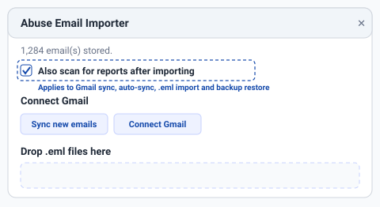

## What counts as an abuse report email

Gmail sync searches two sender addresses: `support@nianticlabs.com` and `support-explore@scopely.com`. These are Niantic Support's "Reporting Abuse in Wayfarer" ticket threads. If tickets stop arriving from one of them, a new sender address may be in use.

Dropped `.eml` files are accepted from any sender. Non-abuse-report emails are screened out when you scan.

## Multiple Wayspots per ticket

A single ticket can report more than one Wayspot, either all at once in the original submission or with more added in a later reply. The extractor picks up all of these:

- The original form's **Provide details of the location(s)** field is split per line, so a report listing several Wayspots (as `Name (lat, lng)`, `Name, lat,lng` or `"Name" at lat,lng`) becomes one entry per line.
- Every other message in the thread is also scanned, both for list-style replies and for coordinates mentioned in ordinary sentences. When a coordinate appears in a longer sentence with no clean label before it, the location is still added, but with the name left blank rather than showing a run-on sentence as a Wayspot name.

Each entry becomes its own row, sharing that ticket's `Conversation ID`. A corrected coordinate mentioned in the original submission's free text (for example "is actually here: ...") is treated as a correction, not as a new location. A Street View or Maps link near a location is kept as that entry's `Comment`. If a reply mixes a genuinely new Wayspot into the same sentence as a correction, it may need a manual check.

## Long-running tickets spanning several emails

An active ticket generates a new email for every reply, and each email only contains a recent window of the conversation. If you've imported more than one email for the same ticket, the extractor merges them into one complete thread before extracting, so a Wayspot mentioned only in an older email is still picked up. For the most complete picture, import every email you have for an active ticket. Auto-sync already does this for you.

## Replies sent from your own mail client

Replying with your mail client's normal reply button (Gmail's, for example) works as well as using Helpshift's own reply link. The extractor detects the quoted history automatically and separates your new reply from it.

## Ticket status

`Ticket Status` is Niantic Support's own reply, classified against three canned closing messages:

| Status | Matches | Meaning |
|---|---|---|
| **Actioned** | *"We have reviewed the report and have taken action on the Wayspots in accordance with our policies."* | Reviewed and acted on. Nothing further to do. |
| **Pending Review** | *"Thank you for your patience as your report is being looked into. We will follow up once we have reviewed the reported Wayspots."* | Still under review. Revisit later. |
| **Denied** | *"We took another look at the Wayspot in question and decided that it does not meet our criteria for removal at this time."* | Reviewed, no action taken. Nothing further to do. |

Two other values can appear:

- **Received**: only the initial automatic acknowledgement, with no human reply yet.
- **Updated**: the newest message is a custom human reply, or a follow-up from the reporter.

Only the newest message in the thread is checked. If the reporter sends a follow-up (say, a "thanks!") *after* the real decision, the status reads **Updated** again even though a decision was made earlier. This is expected behavior.

Statuses show as color-coded badges, and searching for a status name (e.g. "pending") matches them. Wayspots brought in with **Import CSV** get their own purple **Imported** badge.

## Flagging nearby duplicate reports

Rows get a ⚠️ and a subtle highlight when their coordinates fall within 20 m of a location from a **different** ticket, meaning the same spot was reported more than once independently. Click the ⚠️ for a popover listing which tickets and how far away. Each entry is clickable and jumps the map to that match. The same detail is in the CSV's `Nearby Tickets` column.

Locations within one ticket are never flagged against each other.

## Starring rows & Last Response

- Click a row's ★ cell to star it. Click the ★ column header to sort (ascending shows starred rows first). Starred rows stay starred when you re-scan.
- The **Last Response** column shows the newest message across every email imported for that ticket. It is sortable, and rows without a parseable date always sort last. In the CSV it appears as `Last Response (UTC)`, in ISO 8601 format.

## Editing a row

Every row ends with a pencil (✎). Rows are locked by default. Click the pencil to unlock that row, which turns its cells into inputs: **Conversation**, **Wayspot Name** (with a **Note** field underneath), **Coordinates** (`lat, lng`, or blank for none), **Status** (dropdown) and **Last Response** (date/time picker).

- **✓** saves and **✕** discards. **Enter** also saves and **Esc** also cancels.
- Only one row is editable at a time. Opening another discards the first one's unsaved changes.
- Coordinates that aren't a valid `lat, lng` pair are rejected and the field is highlighted.

Saved edits update the table, map crosses, nearby-ticket flags, search and CSV export straight away. An edited row shows a small blue dot next to its pencil and is kept when you re-scan, even if you changed its coordinates. **Clear Extracted Data** wipes everything, including edited rows.

## Importing locations from elsewhere (CSV)

**Import CSV** (next to Export CSV) is for locations that didn't come from a scanned email, such as a known problem spot from another source. It is not for re-importing this tool's own export.

Only a latitude/longitude column pair is required. Common header spellings are accepted (`Lat`/`Latitude`, `Lng`/`Long`/`Longitude`, case-insensitive). `Name`, `Comment` and `Conversation ID` are optional.

```
Latitude,Longitude,Name,Comment,Conversation ID
1.234567,1.234567,Example Wayspot,Optional note,12345
```

Imported rows appear in the table and on the map like any other, with a purple **Imported** badge and their own **Imported color** markers. They survive re-scans. Since they have no source email, **Clear Extracted Data** removes them for good, and its confirmation message warns you about this.

## Searching

The search box above the table filters on name, conversation ID, comment, issue type, both raw text fields and the source filename/email ID. A leading `#` is ignored, so `#12345` finds the same reports as `12345`.

Search only changes what the table displays. **Export CSV**, the map crosses and the summary counts always reflect everything.

## Large histories

The table shows 200 rows at a time, with **Prev**/**Next** controls once you have more. This keeps things fast even with thousands of rows.

## Plotting on the map

Tick **Abuse Report Crosses** in the **Layers** menu to plot every extracted location on the Wayfarer map.

- **Clustering.** Nearby locations merge into a single numbered badge when zoomed out and split into individual X markers as you zoom in.
- **Popups.** Click a marker for its name, coordinates, comment, and ticket ID with the date of the ticket's last interaction. Click a cluster to zoom in on it. If a cluster's reports all share the same coordinates, clicking it at maximum zoom opens a popup listing every ticket in it.
- **Remembered state.** Your on/off choice is remembered and re-applied on the next page load. Markers stay in sync after every scan or clear.
- **Where it works.** On both the general map view and the zoomed-in submit/edit view, switching between them automatically.
- **Jumping from the table.** Click any table row with coordinates to jump the map there and open the same popup. The panel closes so you can see the map. Untick **Close this panel when a row jumps the map to its location** (below the search box) to keep it open while you click through several rows.

### Live Wayspot annotation

Independent of the crosses layer: click any Wayspot on the map, and if it is within 20 m of one of your extracted locations, its details card in the side panel gets a `#<ticket>` line just above the status badge. Several matching tickets are shown comma-separated. The line ends with the date of the most recent interaction (short date, with the full date and time on hover).

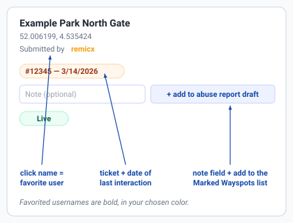

### On the review page

Crosses also plot on `https://wayfarer.scopely.com/new/review`, on the duplicate-check map and the edit-location/edit-info maps. This lets you see nearby prior abuse reports while reviewing a nomination.

The review page has its own small on/off bar below the map (on by default), separate from the Layers menu. Review-page markers are always click-through, regardless of the "Clickable markers" setting, so they never get in the way of the review UI underneath.

### Marker Style

Click the cog icon in the Abuse Reports panel header to open Marker Style. It covers:

- **Color**, **size** and **fill opacity** of the map markers, plus ring color, width and opacity for cluster badges. The X shape of individual reports is fixed, so only its color and size are adjustable.
- **Imported color** for CSV-imported locations. It follows **Color** until you pick one of your own. **Same as email color** or **Reset to default** returns it to following. A cluster only takes the imported color when *every* location in it is imported.
- **Marked Wayspot color** and **Favorite user color** (see below).
- **Clickable markers (mapview/submit only)**: turn this off to let clicks pass through to whatever is underneath instead of opening this plugin's popup.

Changes apply live to markers already on the map.

## Resizing table columns

Drag the border between two column headers to resize them. A drag trades width between the two neighboring columns, so the table always stays full-width, and no column can be squeezed too small. Widths are remembered across sessions and included in **Settings > Backups**.

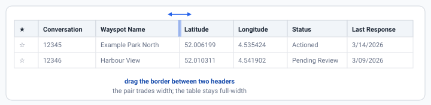

## Marked Wayspots

A separate scratch list for Wayspots you're about to report yourself. It is independent of the ticket table, which covers reports already filed.

**Adding.** Click a Wayspot on the map. In its details card in the side panel, type an optional note (up to 300 characters) and click **+ add to abuse report draft**. It flashes **✓ Added**. If the Wayspot is already on the list (matched by coordinates, not name), its note is overwritten with whatever is in the field, including being cleared if the field is empty, and the button flashes **✓ Updated**. A Wayspot's name is only ever filled in or improved this way, never blanked. An "Untitled location" shows as "(unnamed)". The same note field and button also appear on the review page.

**The list.** Open it with the list icon in the Abuse Reports panel header (titled **Abuse Reports - Marked Wayspots**):

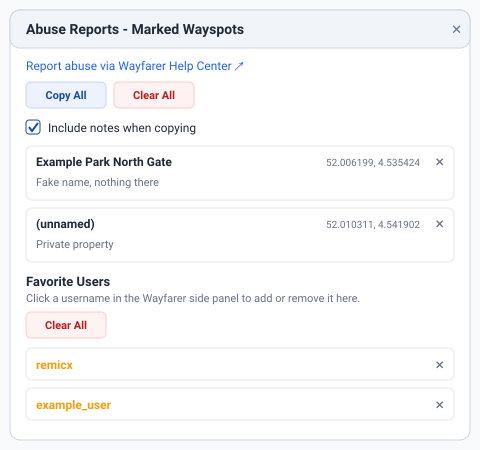

- A **Report abuse via Wayfarer Help Center** link opens Niantic's "Reporting Abuse in Wayfarer" article, where you paste the copied text.
- **Copy All** puts one line per entry on the clipboard as `Name, lat, lng (note)`, with coordinates to six decimals and the note only when there is one.
- **Include notes when copying** (on by default) removes the notes, giving plain `Name, lat, lng` lines. It is saved, and also applies to the copy icon on the review page.
- **Clear All** empties the list after confirmation.
- **Click a row** to jump the map there and open a popup with its name, coordinates and note. Click a row's **note** to edit it in place (click outside the box to save), and click **×** to remove the entry.

**On the map.**

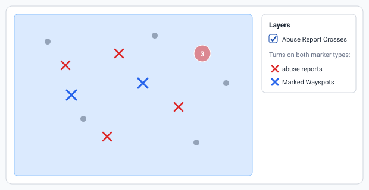

Every entry also gets a cross marker on the map view, in its own color (default blue, changed with **Marked Wayspot color** in Marker Style) and sized by the same **Cross size** slider. Click one for its details. These markers follow the **Abuse Report Crosses** checkbox in the Layers menu.

The list is saved with the suite's settings, so it is included in **Settings > Backups**.

## Favorite users

When Wayfarer shows a **Submitted by <username>** line in the side panel (for example while reviewing a nomination), click the username to mark that user as a favorite, and click again to remove them. A favorite turns bold in a color you choose with **Favorite user color** in Marker Style (default amber; **Reset to default** restores it). Names are matched ignoring case and surrounding spaces.

Favorites are listed in a **Favorite Users** section of the same window as the Marked Wayspots list, each with an **×** to remove it and a **Clear All** button (with confirmation).

- **Notes.** Each favorite has its own note (up to 1000 characters). Click **Click to add a note…**, type, and click outside the box to save. Notes appear in the list only and are never part of what you copy.
- **Copying usernames.** Every row has a checkbox. **Copy All** copies every username, one per line. **Copy Selected** (which shows a count, e.g. *Copy Selected (3)*, and stays disabled until something is ticked) copies only the ticked ones. The button briefly reads **Copied!** (or **Copy failed**). Ticks aren't saved and reset when the window is reopened or you **Clear All**.

Favorites are saved with the suite's settings and included in **Settings > Backups**.

## Abuse helper on the review page

This replaces the standalone **Wayfarer Abuse Text Formatter** script. Uninstall that script once this one is running, or you'll see both. On `https://wayfarer.scopely.com/new/review`, every review candidate (new Wayspot, photo or edit) gets a small row containing:

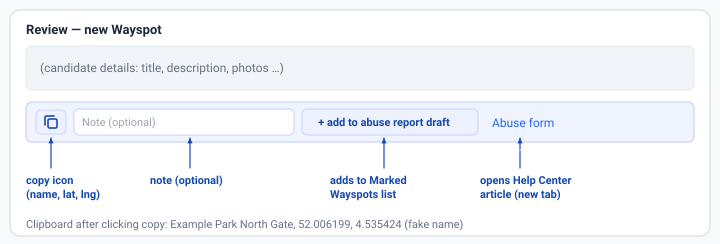

- a **copy icon** that copies `Name, lat, lng` in the same format as the Marked Wayspots list's Copy All, with the row's note appended when **Include notes when copying** is on. The icon briefly turns into a check mark to confirm;
- a **note field** and **+ add to abuse report draft** button, which add the candidate to your Marked Wayspots list (overwriting the note if it's already there);
- an **Abuse form** link to the Help Center article, opening in a new tab so your review in progress isn't lost.

The row only appears while the plugin is enabled in the Plugin Manager.

## CSV columns

`Starred`, `Conversation ID`, `Ticket Status`, `Last Response (UTC)`, `Wayspot Name (best guess)`, `Latitude`, `Longitude`, `Comment`, `Nearby Tickets (<20m, other tickets)`, `Issue Type`, `Location Details (raw)`, `Report Details (raw)`, `Source Email ID`, `Source Filename`.

- `Comment` holds a Street View / Maps link found near that specific location. It shows as a hover-for-full-text 💬 in the table.
- `Nearby Tickets` lists other tickets with a location within 20 m of this row.
- `Source Email ID` / `Source Filename` list every email that contributed to the row (semicolon-separated).
- `Issue Type`, `Location Details (raw)` and `Report Details (raw)` are written only on a ticket's **first** row and left blank on its other rows, since that text belongs to the ticket rather than each location. Use `Conversation ID` to group rows back together. `Comment` is written on every row.
- The two "(raw)" columns let you sanity-check or hand-correct a bad guess in a spreadsheet.
- A hand-edited row exports its edited values, not the original scanned ones.

## Data storage & privacy

Everything is stored in your own browser (IndexedDB and the suite's settings) and never leaves it, apart from the Gmail API calls you make yourself.

- **Imported emails** are kept in one local database.
- **Extracted reports** are kept in a second, separate local database.
- **Your preferences and lists** (Marker Style settings including the Marked Wayspot and Favorite user colors, the close-panel-on-jump and copy-with-notes checkboxes, the scan-after-import checkbox, column widths, the Marked Wayspots list and the Favorite Users list) live in the suite's settings, so they are included in the suite's **Settings > Backups** export/import.

Both the importer and the extractor panels have **Export backup JSON**, **Import backup JSON** and **Clear** buttons. Clearing extracted data does not touch your imported emails, so you can re-scan at any time to rebuild it.

## Known limitations

- Name and coordinate extraction is **best-effort**. It has been refined against many real tickets but is not derived from a formal specification. Treat low-confidence rows, especially anything unusual, as needing a manual check before you rely on them.
- A location's *name* is only kept when a short, clean label was found. Otherwise the location is added with a blank name rather than a guess.
- A reply that mixes a new Wayspot into the same sentence as a correction may need a manual check.

## Troubleshooting

- **The scripts don't appear anywhere.** Make sure the wayfarer-map-mods suite (v4.0.0 or newer) is installed and enabled, and that you are on a `https://wayfarer.scopely.com` page.
- **A script works but isn't listed under External plugins in the Plugin Manager.** Update to the latest version of both scripts.
- **Gmail sign-in is refused.** Check that your Google account is listed under **Test users** and that `https://wayfarer.scopely.com` is in the OAuth client's **Authorized JavaScript origins**.
- **Tickets stopped arriving in Gmail sync.** Check whether tickets are now coming from a new sender address (see [What counts as an abuse report email](#what-counts-as-an-abuse-report-email)).

## Credits

The email parsing and classification library is a vanilla-JS port of the `src/email` module from [bilde2910/OPR-Tools](https://github.com/bilde2910/OPR-Tools). The scripts build on [Tntnnbltn's wayfarer-map-mods suite][base].
